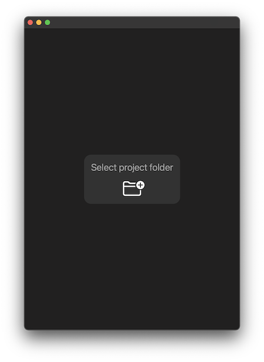
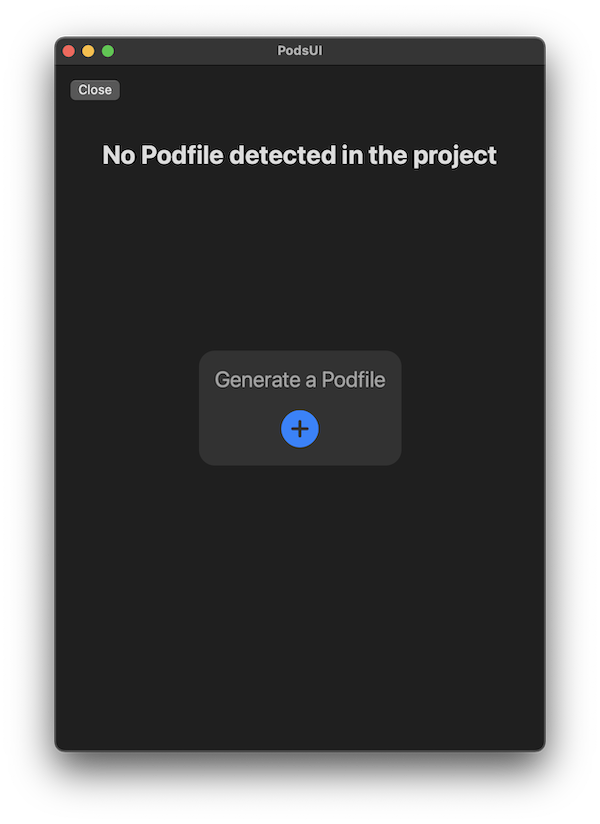
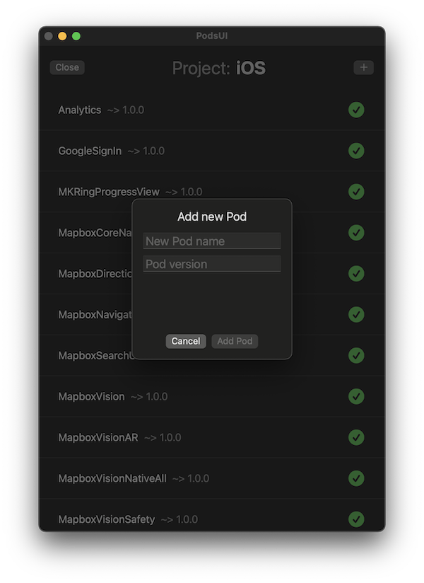
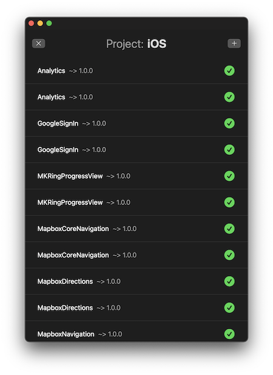

# PodsUI
## 🚧 Work In Progress 🚧
## A simple Mac app to manage your cocoapods.

# Preview

### 1. Select project folder

### 2. Generate Podfile for your project

### 3. Add new Pods to your project

### 4. Disable or enable pods

 
# ➡️ Download

Download the latest version on the [releases](https://github.com/RomanEsin/PodsUI/releases) page.
